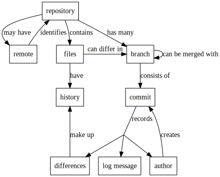
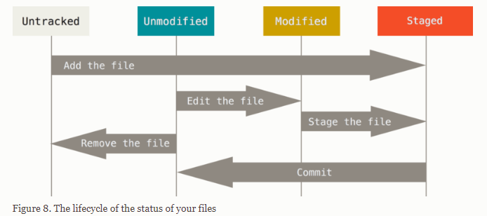
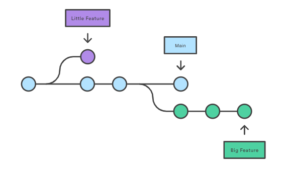
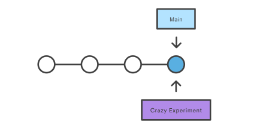
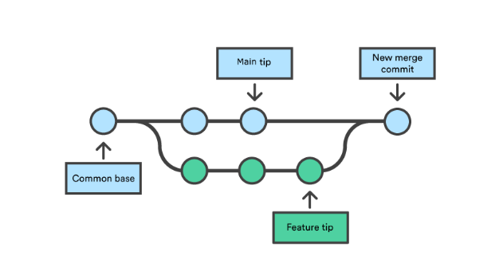
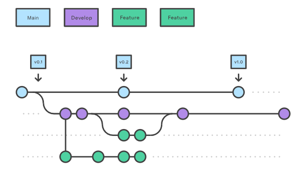
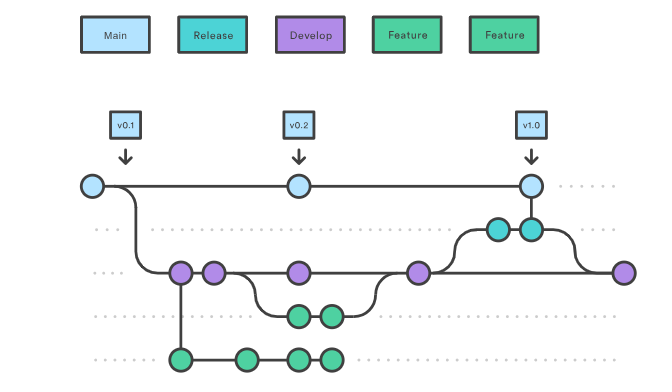
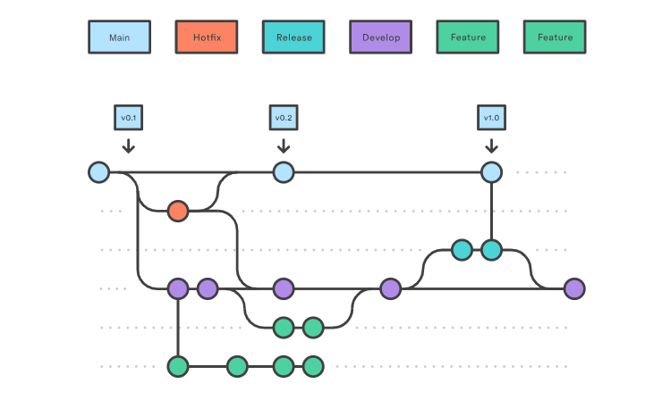

# Project Name

Islam Hakeem Repo

## Usage

brief about Version control 

--------------------------------------------------
# why we use git ?

1. Track evrything in project
2. History track 
3. save everything changed 
4. evrychange have a uniq Id 
------------------------------------------------------

1- In first this is concept of VCS 

# git have 3 States of a Git Project 

Working tree -- stageing area -- repoitory 

## 1- working tree : 
is the directory on your local machine where you are currently working on files. It contains the actual files and directories that you see and edit.
evrything you Added(file - -folder - image - anything)in your projects , in this case called untracked file 
and state => untracked assign to letter (U)

to go next step use (git add . to make all changed in staging area) or ( git add <fileName>) 

## 2-staging area :
 staging area second step after W.T in this case state of files (Modified) and ready to push to your repo , after commited ,
every commit have a unique ID called (hash - SHA_1) that is save your changed hitory if need back  to it .

The staging area is an intermediate area where changes to files are gathered before they are committed. It’s like a preview of the next commit. When you stage files, you're telling Git, "I want to include these changes in the next commit."
assign to letter (M)

## 3-The repository
 is where Git stores all the information about the project, including the history of all the commits, branches, tags, and more. The repository contains the actual commits, which are snapshots of the project at various points in time.

### there are Remot and local Repository :

local Repo -> in your machine not showing to anyone 
Remote Repo -> version of your project that is hosted on the internet or another network. It allows multiple developers to work on the same project from different locations. GitHub, GitLab, and Bitbucket are popular platforms that host remote repositories.
git host [bitbucket -- gitlab -- github]

# Git basics :

## Initializing a Repository : 

go to your directory and open terminal then use this command  "$ git init" This creates a new subdirectory named .git that contains all of your necessary repository files

if you want start your repo , create a file "file1.txt" and use
$ git add file1.txt
$ git commit -m "Initial commit"

## Cloning an Existing Repository
to clone a existrepo on any host "git clone <url>"

## lifecycle of the status of your files

Checking the Status of Your Files "$git status" show you all changes status

## see what you’ve changed 
not yet staged type git diff with no other arguments to see changes in W.T
staged type git diff --staged  This command compares your staged changes to your last commit

## Viewing the Commit History
When you run "$git log" in this project, you should get output
1- commit hash (SHA-1) 
2- commit messege
3- date
4-auther 
"$git log --oneline -10" see last 10 commits only 

## Undoing Things
### $ git commit --amend

use this command if you need to edit commit messege

### git checkout -- README.md

This command discards any local changes you have made to the README.md file and reverts it to the last committed version in your local repository.
If README.md is modified in your working directory and you haven't staged the changes yet, this command will reset the file back to its state in the last commit.

### git reset
1. Unstaging Files (git reset HEAD <file>):
If you've staged files using git add but haven't committed them yet, you can unstage them with:  git reset HEAD <file>
This command removes README.md from the staging area, but keeps your changes in the working directory.

2. Soft Reset (git reset --soft <commit>):
Keeps your changes in the staging area (index) and working directory but moves the HEAD pointer to the specified commit.
git reset --soft HEAD~1

3. Mixed Reset (git reset --mixed <commit>):
Unstages the changes (removes them from the index) but keeps the changes in your working directory.
git reset --mixed HEAD~1

4. Hard Reset (git reset --hard <commit>):
Removes the changes from the staging area and working directory, resetting everything to the specified commit. This is destructive and cannot be undone.
git reset --hard HEAD~1

### git restore and argument with it

 git restore is a command used to restore files in your working directory to a specific state. It can be used with several arguments depending on what you want to restore:

1. git restore <file>: This will discard changes in the working directory for the specified file, reverting it to the state of the last commit.
Restoring Changes from the Staging Area:

2. git restore --staged <file>: This will unstage changes that have been added to the staging area but leave them in the working directory.
Restoring to a Specific Commit:

3. git restore --source <commit> <file>: This restores the file to its state in the specified commit, whether it's a commit hash or a branch name.

## Working with remote
1. Adding Remote Repositories :: $ git remote add <Url>
2. if you have more remote you can show it by :: $ git remote -v
3. to get all branches in remote host to your local :: $ git fetch
4. get all changes in remote :: $ git pull

## Tagged 

tag is a reference to a specific point in the commit history. Tags are often used to mark important points in the repository's history, such as releases or milestones. There are two main types of tags in Git:

1. create Tag : git tag -a v1.0 -m "Version 1.0 release" creates an annotated tag named v1.0 with a message.
2. Viewing Tags : git tag
3. To view details of a specific tag, especially annotated tags, use: git show <tagname>
4. Pushing Tags : git push origin <tagname>
5. Deleting Tags : git tag -d <tagname>

# Git Branch
Git branches are effectively a pointer to a snapshot of your changes. When you want to add a new feature or fix a bug—no matter how big or how small—you spawn a new branch to encapsulate your changes

this diagram show two isolated lines of development, one for a little feature, and one for a longer-running feature. By developing them in branches, it’s not only possible to work on both of them in parallel, but it also keeps the main branch free from questionable code.

## Creating branches

- create a branch using : git branch <branch-name> but it still in local Repo you need to move it to Remote server to be allawed for other developers
this image show create a new branch frommain that is take head pointer of last commit in main branch 

- Creating remote branches
to push you branch in remote repo use : git push --set-upstream origin <branch-name>

- Checkout branches : The " git checkout <branch-name>" command lets you navigate between the branches created
- git checkout -b ＜new-branch＞: create new branch and switch to this branch you are created

# Git merging

## Git merge 
will combine multiple sequences of commits into one unified history. In the most frequent use cases, git merge is used to combine two branches : git merge

## merge conflict 
in Git occurs when changes from two branches (that you're trying to merge) cannot be automatically combined. This often happens when different changes have been made to the same line of a file in both branches or when one branch deletes a file that the other branch has modified. Here's how to handle merge conflicts

### Steps ex:
1. Start the Merge:
    git checkout main
    git merge feature-branch
2. Conflict Detected: Git indicates that file.txt has conflicts.
3. open "file.txt" to resolve conflict
4. stage resolved by 
    git add .
    git commit -m "solve conflicts between main and feature-branch"
    git push

## merge strategies 
merge strategies determine how changes from different branches are combined when you perform a merge. The choice of merge strategy can affect how conflicts are handled

### merge strategies : 
1. Recursive (default)
Usage: This is the default strategy when merging two branches.
"git merge branch-name"
2. Resolve
Usage: This strategy is used for merging two branches when you want to prioritize one branch over the other.
"git merge -s resolve branch-name"
3. Octopus
Usage: This strategy is used for merging more than two branches at the same time. It can handle multiple branches in a single merge but is best suited for cases where conflicts are unlikely or simple to resolve. 
git merge -s octopus branch1 branch2 branch3
4. The Ours merge
is a specialized tool used to resolve merge conflicts by favoring the changes from the current branch over the changes from the branch being merged. This strategy is useful when you want to perform a merge but explicitly want to ignore the changes from the other branch, effectively keeping your current branch's content unchanged
git merge -s ours branch-name
5. Subtree 
The Subtree merge strategy in Git is used to integrate the contents of one repository into a subdirectory of another repository
git merge -s subtree branchA branchB

# Gitflow workflow
Git Flow is a branching model designed to streamline the process of managing multiple branches in Git repositories.Git Flow provides a structured approach to handling feature development, releases, and hotfixes, making it easier to maintain a stable production codebase while allowing for ongoing development.

## 1. Main Branches

main (or master or Production): This branch represents the production-ready code. It contains the latest stable release.
develop: This branch serves as the integration branch for features. It holds the latest development changes that are ready to be included in the next release.

## 2. Additional branches

### Feature Branches:

Naming Convention: feature/<feature-name>
 Used to develop new features or enhancements. Created from develop and merged back into develop when complete.

### Release Branches(Teasting):

Naming Convention: release/<version>
Used to prepare for a new release. Created from develop when the code is feature-complete and ready for final testing. Merged into both main and develop after the release.

### Hotfix Branches:

Naming Convention: hotfix/<issue>
Purpose: Used to quickly address critical issues or bugs in production. Created from main, merged back into both main and develop after the fix.

# forking 
1. A developer 'forks' an 'official' server-side repository. This creates their own server-side copy.

2. The new server-side copy is cloned to their local system.

3. A Git remote path for the 'official' repository is added to the local clone.

4. A new local feature branch is created.

5. The developer makes changes on the new branch.

6. New commits are created for the changes.

7. The branch gets pushed to the developer's own server-side copy.

8. The developer opens a pull request from the new branch to the 'official' repository.

9. The pull request gets approved for merge and is merged into the original server-side repository

To integrate the feature into the official codebase, the maintainer pulls the contributor’s changes into their local repository, checks to make sure it doesn’t break the project, merges it into their local main branch, then pushes the main branch to the official repository on the server. The contribution is now part of the project, and other developers should pull from the official repository to synchronize their local repositories

## Forking vs. Cloning
Cloning
Definition: Cloning creates a local copy of a repository on your computer. It downloads the repository’s files, history, and branches to your local machine.

Forking
Definition: Forking creates a new copy of a repository under your own account on a Git hosting platform (like GitHub, GitLab, or Bitbucket). This new repository is independent of the original repository but maintains its history.

